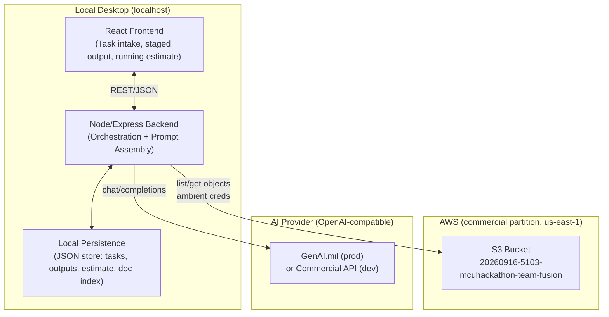
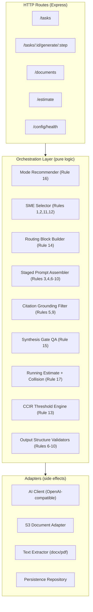
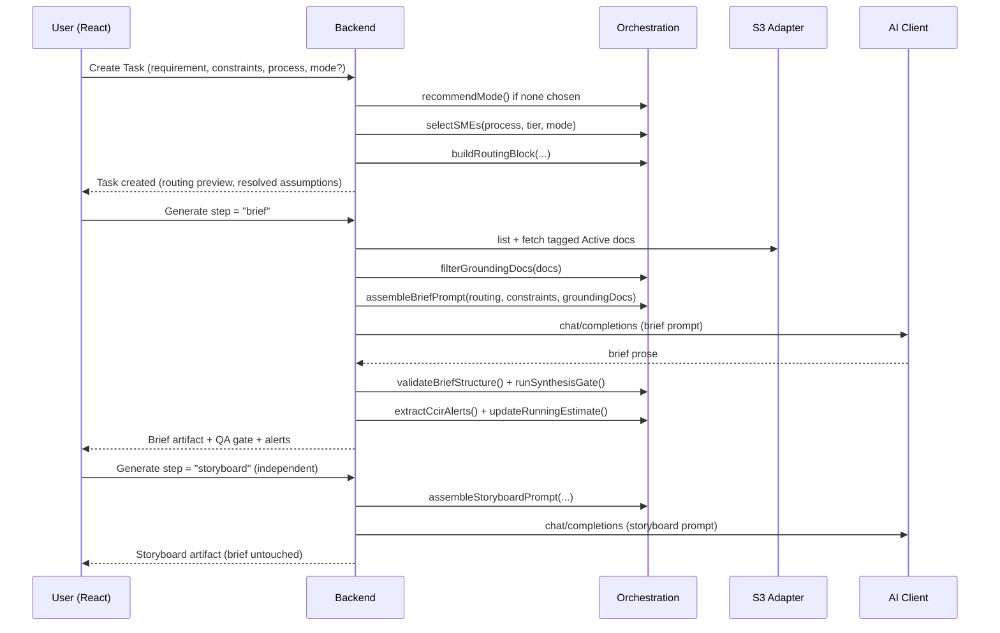

# Design Document

## Overview

The SAGE Briefing Application is a local, single-user desktop web application that operationalizes the TECOM Strategic Academics Guru Executive (SAGE) Master Orchestration Directive (v10). It converts the directive from a fragile chat prompt into a deterministic tool that assembles staged, grounded prompts from structured inputs, orchestrates a simulated 34-SME staff, and produces five families of staff-quality outputs.

The core design insight is that most of the SAGE directive's "rules" are not free-form AI behaviors — they are **deterministic orchestration logic** that decides *what to ask the AI* and *how to validate what comes back*. The app pushes as much correctness as possible into pure, testable TypeScript (routing, SME selection, mode recommendation, citation filtering, constraint-to-assumption conversion, running-estimate collision detection, CCIR threshold checks, output-structure validation) and reserves the live AI call for the actual natural-language synthesis.

### Design Goals

1. **Grounded, never hallucinated** — baseline constraints are structured inputs; blank constraints become explicit assumptions; citations come only from tagged, Active documents.
2. **Staged generation** — the brief and the storyboard (and each report) are separate generation steps that can be regenerated independently, avoiding context-window exhaustion.
3. **Real orchestration** — SME selection and sequencing are computed from process/tier/mode, not simulated in a single pass.
4. **Provider-agnostic** — the AI client speaks the OpenAI-compatible protocol and reads endpoint/model/credentials from configuration, so the same binary runs against GenAI.mil (production) or a commercial API (development).
5. **Deterministic where it matters** — routing blocks, QA gates, and validation are pure functions with property-based guarantees; only synthesis prose is model-generated.

### Key Technical Decisions

| Decision | Choice | Rationale |
|---|---|---|
| Deployment | Local desktop web app, localhost only | Single-user; no multi-tenant auth or hosting concerns |
| Frontend | React + TypeScript | Rich staged-generation UX, per-step regeneration |
| Backend | Node/Express + TypeScript | Shared types with frontend; hosts orchestration + AI/S3 clients |
| AI generation | Provider-agnostic OpenAI-compatible client | GenAI.mil in prod, commercial API in dev, config-driven |
| Document source | AWS S3 (commercial partition, `us-east-1`) | Ambient credential chain; `20260916-5103-mcuhackathon-team-fusion` |
| Document handling (v1) | Simple document context (list/read/tag/extract/inject) | No vector RAG in v1; text injected directly as grounding |
| Local persistence | Local file-backed store (JSON documents on disk) | Single-user; persists tasks, outputs, running estimate, doc metadata |

## Architecture

### System Context



### Backend Layered Architecture



The **Orchestration Layer** is deliberately pure (no I/O): it takes typed inputs and returns typed outputs (routing blocks, selected SMEs, assembled prompt strings, filtered document sets, validation results). This is where property-based testing concentrates. The **Adapters** isolate the three side-effecting concerns — AI calls, S3 access, and text extraction — behind interfaces so the orchestration logic can be tested with in-memory fakes.

### Staged Generation Flow



Each generation **step** is independently addressable (`/tasks/:id/generate/:step`). Regenerating one step (e.g., `storyboard`) never mutates the others, satisfying staged generation and per-step regeneration.

## Components and Interfaces

### Frontend Components (React)

- **TaskIntakeForm** — free-text requirement field plus structured constraint fields (billets, POM funding cycle, facilities/ranges), Core Operational Process selector (Rule 12), and Operational Mode selector with a "Recommend" affordance (Rule 16).
- **AssumptionsPanel** — shows which blank constraints were converted into explicit assumptions before generation.
- **RoutingBlockView** — renders the PROCESS / TIER / SMEs TO TASK / MODE / SEQUENCE block prepended to output.
- **StagedOutputWorkspace** — one tab/section per output step (Brief, Storyboard, SITREP, CUB, QPR, Order, Curriculum), each with an independent "Regenerate this step" button and status (pending / generating / complete / failed).
- **SynthesisGatePanel** — displays the four QA checks and highlights any failures before finalizing (Rule 15).
- **CcirAlertBanner** — prominent banner for fired CCIR triggers with triggering condition and recommended immediate action (Rule 13).
- **RunningEstimateView** — Billet Balance, Funding Status, Active CCIR Alerts, collision flags, and revision history (Rule 17).
- **DocumentLibraryView** — lists S3 docx/pdf objects with metadata-tagging UI; visually flags untagged (excluded) and Superseded/Draft documents.
- **AiConfigHealth** — surfaces AI endpoint reachability and clear error state (Rule 14).

### Backend Service Interfaces

```typescript
// Orchestration (pure) ---------------------------------------------------

interface ModeRecommender {
  // Rule 16: recommend a mode from requirement text + process when none chosen
  recommend(input: { requirementText: string; process: CoreProcess; }): OperationalMode;
}

interface SmeSelector {
  // Rules 1,2,3,11,12: choose SMEs and their sequence from the 34-SME arsenal
  select(input: {
    process: CoreProcess;
    tier: Tier;
    mode: OperationalMode;
  }): { smes: Sme[]; sequence: SmeSequence };
}

interface RoutingBlockBuilder {
  // Rule 14: PROCESS, TIER, SMEs TO TASK, MODE, SEQUENCE
  build(input: {
    process: CoreProcess;
    tier: Tier;
    mode: OperationalMode;
    smes: Sme[];
    sequence: SmeSequence;
  }): RoutingBlock;
}

interface ConstraintResolver {
  // Rule R1.3: blank constraints -> explicit assumptions
  resolve(constraints: Constraints): {
    resolved: Constraints;
    assumptions: Assumption[];
  };
}

interface GroundingFilter {
  // Rules 5,9,10.4: only tagged + Active docs ground output; flag Superseded/Draft
  filter(docs: SourceDocument[]): {
    grounding: SourceDocument[];        // fully tagged; usable
    excluded: SourceDocument[];         // missing metadata -> excluded
    flaggedSources: SourceDocument[];   // tagged Superseded/Draft -> usable but flagged
  };
}

interface PromptAssembler {
  // Rules 3,4,6-10: build a staged prompt string for one output step
  assemble(input: {
    step: OutputStep;
    routing: RoutingBlock;
    requirementText: string;
    resolvedConstraints: Constraints;
    assumptions: Assumption[];
    grounding: SourceDocument[];
    hierarchyOfTruth: HierarchyOfTruth; // Legality > Doctrine/Strategy > Feasibility > Human Dynamics
  }): AssembledPrompt;
}

interface OutputValidator {
  // Rules 6-10: validate returned prose against structural rules
  validateBrief(text: string): ValidationResult;        // Rule 6 sections + BLUF + binary decision
  validateStoryboard(text: string): ValidationResult;   // Rule 7/8: 6 slides + word limits
  validateSitrep(text: string): ValidationResult;       // Rule 10: 5-line report
  // ...CUB, QPR, Order, Curriculum
}

interface SynthesisGate {
  // Rule 15: Legal Clearance, Strategic Uplift, Citation Verification, Binary Decision Point
  run(input: { briefText: string; grounding: SourceDocument[]; }): SynthesisGateResult;
}

interface CitationChecker {
  // Rules 5,9: every bracketed [Doc_ID,...] must map to an Active grounding doc
  check(text: string, grounding: SourceDocument[]): {
    verified: Citation[];
    ungroundable: UngroundableClaim[]; // flagged, not invented
  };
}

interface CcirEngine {
  // Rule 13: evaluate thresholds -> alerts with recommended action
  evaluate(input: { constraints: Constraints; estimate: RunningEstimate; }): CcirAlert[];
}

interface RunningEstimateService {
  // Rule 17: persist + detect downstream resource collisions + revision history
  apply(prev: RunningEstimate, taskOutcome: TaskOutcome): {
    next: RunningEstimate;
    collisions: ResourceCollision[];
  };
}

// Adapters (side effects) ------------------------------------------------

interface AiClient {
  // Rule 14: OpenAI-compatible; endpoint/model/creds from config
  complete(prompt: AssembledPrompt): Promise<AiResult>; // clear error if unreachable
}

interface S3DocumentAdapter {
  // Rule 10: ambient credential chain; list docx/pdf under configured prefix
  list(prefix: string): Promise<S3ObjectRef[]>;
  get(key: string): Promise<Buffer>;
}

interface TextExtractor {
  extract(objectRef: S3ObjectRef, bytes: Buffer): Promise<ExtractedText>; // docx/pdf
}

interface Repository {
  saveTask/getTask/saveOutput/getEstimate/saveEstimate/saveDocIndex(...): Promise<...>;
}
```

### Configuration Interface

```typescript
interface AppConfig {
  ai: {
    endpoint: string;   // e.g. GenAI.mil URL (prod) or commercial API (dev)
    model: string;
    apiKey?: string;    // from env/secret store, never hardcoded
  };
  s3: {
    bucket: string;     // "20260916-5103-mcuhackathon-team-fusion"
    region: string;     // "us-east-1"  (commercial partition)
    prefix: string;     // e.g. "Agents/"
    // credentials come from the ambient AWS chain, NOT this file
  };
  persistence: { dataDir: string; };
}
```

Configuration is read at startup from environment variables and/or a local config file. The AI section is provider-agnostic: switching from a commercial dev endpoint to GenAI.mil requires only changing `endpoint`/`model`/`apiKey`, with no code changes because the client speaks the OpenAI-compatible `chat/completions` protocol. S3 credentials are never in config — the AWS SDK resolves them from the ambient chain (environment, shared credentials file, or IAM role).

## Data Models

```typescript
// --- Enumerations aligned to the SAGE directive ---
type OperationalMode = "Lite" | "Standard" | "FullStaff" | "CrisisAction"; // Rule 16
type Tier = "Strategic" | "Operational" | "Tactical";          // directive's three echelons: Strategic/Operational/Tactical
type CoreProcess =                                                          // Rule 12
  | "ProgramObjectiveMemorandum"
  | "CampaignPlanning"
  | "CurriculumDevelopment"
  | "CapabilityAssessment"
  | "CrisisResponse"
  | "PolicyDevelopment";
type DocStatus = "Active" | "Superseded" | "Draft";
type OutputStep =
  | "brief" | "storyboard" | "sitrep" | "cub" | "qpr" | "order" | "curriculum";

// --- SME arsenal (34 SMEs) ---
interface Sme {
  id: number;                 // 1..34
  name: string;
  tier: Tier;
  domains: string[];          // e.g. ["Legal"], ["Logistics"]
  category: "PrimaryAdvisor" | "SpecialStaff" | "TechnicalSme";
}
type SmeSequenceKind = "parallel" | "sequential" | "handoff"; // Rule 11
interface SmeSequence {
  kind: SmeSequenceKind;
  order: number[];            // SME ids in execution order (for sequential/handoff)
}

// --- Task + constraints (Requirement 1) ---
interface Constraints {
  manpowerBillets?: string;   // undefined/blank -> becomes an Assumption
  fundingPomCycle?: string;
  facilitiesRanges?: string;
}
interface Assumption {
  field: keyof Constraints;
  text: string;               // "No billet data provided; assuming current T/O steady-state."
}
interface Task {
  id: string;
  requirementText: string;    // the [INSERT SPECIFIC REQUIREMENT HERE]
  process: CoreProcess;
  tier: Tier;
  mode: OperationalMode;
  modeWasRecommended: boolean;
  constraints: Constraints;
  resolvedAssumptions: Assumption[];
  routing: RoutingBlock;
  createdAt: string;
}

// --- Routing block (Rule 14) ---
interface RoutingBlock {
  process: CoreProcess;
  tier: Tier;
  smesToTask: number[];       // specific numbered SMEs mobilized
  mode: OperationalMode;
  sequence: SmeSequence;
}

// --- Documents + metadata (Requirement 10) ---
interface DocumentMetadata {         // the five required keys
  Echelon: string;
  Domain: string;
  Doc_Type: string;
  Status: DocStatus;
  Topic_Tags: string[];
}
interface SourceDocument {
  docId: string;               // used in [Doc_ID, ...] citations
  s3Key: string;
  fileType: "docx" | "pdf";
  metadata?: DocumentMetadata; // absent/incomplete -> excluded from grounding
  extractedText?: string;
}

// --- Output artifacts ---
interface Citation { docId: string; locator?: string; }
interface UngroundableClaim { claimText: string; reason: string; }
interface ValidationResult { valid: boolean; violations: string[]; }
interface SynthesisGateResult {
  legalClearance: GateItem;
  strategicUplift: GateItem;
  citationVerification: GateItem;
  binaryDecisionPoint: GateItem;
  passed: boolean;            // true iff all four pass
}
interface GateItem { passed: boolean; detail: string; }
interface OutputArtifact {
  taskId: string;
  step: OutputStep;
  routingBlock: RoutingBlock;   // prepended to every output (Rule 14)
  body: string;                 // model-generated prose
  citations: Citation[];
  ungroundable: UngroundableClaim[];
  flaggedSources: string[];     // Superseded/Draft docIds used
  validation: ValidationResult;
  gate?: SynthesisGateResult;   // present for full briefs
  status: "complete" | "failed" | "truncated";
  generatedAt: string;
}

// --- Running estimate + memory (Rule 17) ---
interface RunningEstimate {
  billetBalance: string;
  fundingStatus: string;
  activeCcirAlerts: CcirAlert[];
  revisions: RunningEstimateRevision[]; // full revision history
}
interface RunningEstimateRevision {
  at: string;
  taskId: string;
  summary: string;
  billetBalance: string;
  fundingStatus: string;
}
interface ResourceCollision {
  resource: string;            // e.g. "Range Alpha", "Instructor SSgt Doe"
  conflictingTaskIds: string[];
  detail: string;
}
interface TaskOutcome {
  taskId: string;
  billetDelta?: string;
  fundingDelta?: string;
  allocatedResources: string[];
}

// --- CCIR (Rule 13) ---
type CcirCategory =
  | "PersonnelReadiness" | "ThreatOvermatch" | "LogisticsFailure" | "FiscalLaw";
interface CcirAlert {
  category: CcirCategory;
  triggeringCondition: string;
  recommendedAction: string;
}

// --- AI + prompt assembly ---
interface AssembledPrompt {
  step: OutputStep;
  system: string;              // encodes SAGE persona + hierarchy of truth + structural rules
  user: string;               // routing block + requirement + constraints + assumptions + grounding
}
interface AiResult { ok: boolean; text?: string; errorMessage?: string; truncated: boolean; }
type HierarchyOfTruth = ["Legality", "DoctrineStrategy", "Feasibility", "HumanDynamics"];
```

### Orchestration and Prompt-Assembly Approach

The directive's rules map to discrete, ordered, mostly-pure transformations. The pipeline turns SAGE rules into staged prompt construction as follows:

1. **Intake & constraint resolution (Rules 1, 12):** capture requirement + constraints + process; `ConstraintResolver` converts blank constraints into explicit `Assumption` records (never invented values).
2. **Triage (Rule 16):** if no mode is chosen, `ModeRecommender` derives one from the requirement text and process; the user can override.
3. **SME selection & sequencing (Rules 2, 11):** `SmeSelector` picks SMEs from the 34-SME arsenal by process/tier/mode and computes a `SmeSequence` (parallel/sequential/handoff). Lite mode yields exactly one SME; Full Staff mobilizes primary advisors + special staff.
4. **Routing block (Rule 14):** `RoutingBlockBuilder` emits PROCESS/TIER/SMEs TO TASK/MODE/SEQUENCE, prepended to every artifact.
5. **Grounding (Rules 5, 9, 10):** S3 docs are listed/extracted; `GroundingFilter` keeps only fully-tagged docs, excludes untagged, and marks Superseded/Draft for explicit flagging. Only grounding docs' text is injected.
6. **Staged prompt assembly (Rules 3, 4, 6–10):** `PromptAssembler` builds one prompt per output step. The system prompt encodes the SAGE persona, the Hierarchy of Truth conflict-resolution order (Legality > Doctrine/Strategy > Feasibility > Human Dynamics), Strategic Uplift, and the exact structural template for the requested step. The user prompt carries the routing block, requirement, resolved constraints, assumptions, and injected grounding text with their `Doc_ID`s.
7. **Model call (Rule 14):** the OpenAI-compatible `AiClient` executes the prompt; on failure it returns a clear error and inputs are preserved.
8. **Post-generation validation (Rules 6–10, 15, 5/9):** `OutputValidator` checks structure/word limits; `CitationChecker` verifies each `[Doc_ID, ...]` maps to an Active grounding doc and flags ungroundable claims; `SynthesisGate` runs the four QA checks for full briefs.
9. **Estimate & alerts (Rules 13, 17):** `RunningEstimateService` updates the estimate, records a revision, and flags collisions; `CcirEngine` evaluates thresholds and emits alerts.

Because steps 1–6, 8, and 9 are pure given their inputs, they are the natural targets for property-based testing; step 7 (the model call) and S3/extraction are covered by mock-based and integration tests.

## Correctness Properties

The orchestration layer is pure and therefore testable with property-based tests. These are the executable correctness properties the implementation must uphold. Each is stated as an invariant that must hold for all valid inputs, along with the directive rule and requirement it enforces.

### Property 1: Routing block always identifies the tasked SMEs (Rule 14, R4)
For every generated artifact, the prepended routing block SHALL contain a non-empty `smesToTask` list, and every id in that list SHALL be a member of the SME set returned by `SmeSelector.select` for the same inputs.
- Property: `∀ task. routing.smesToTask ⊆ selectedSmes(task) ∧ routing.smesToTask ≠ ∅`
- **Validates: Requirements 4.1, 4.2, 3.1**

### Property 2: Lite mode tasks exactly one SME (Rule 16, R2.3)
For any input where `mode = "Lite"`, `SmeSelector.select` SHALL return exactly one SME.
- Property: `mode = Lite ⇒ |select(input).smes| = 1`
- **Validates: Requirements 2.3**

### Property 3: Full Staff mode mobilizes primary advisors and special staff (Rule 16, R2.4)
For any input where `mode = "FullStaff"`, the selected SME set SHALL include at least one `PrimaryAdvisor` and at least one `SpecialStaff` SME.
- Property: `mode = FullStaff ⇒ (∃ s ∈ selected. s.category = PrimaryAdvisor) ∧ (∃ s ∈ selected. s.category = SpecialStaff)`
- **Validates: Requirements 2.4**

### Property 4: Blank constraints become assumptions, never invented values (R1.3)
For every constraint field that is undefined or blank, `ConstraintResolver.resolve` SHALL emit exactly one `Assumption` referencing that field, and SHALL NOT populate the resolved constraint with a fabricated value.
- Property: `∀ f ∈ Constraints. isBlank(input[f]) ⇔ (∃! a ∈ assumptions. a.field = f) ∧ isBlank(resolved[f])`
- **Validates: Requirements 1.3**

### Property 5: Grounding uses only fully-tagged documents (Rules 5, 9, R10.4)
`GroundingFilter.filter` SHALL place a document in `grounding` if and only if it has all five metadata keys present. Documents missing any key SHALL appear in `excluded` and SHALL NOT appear in `grounding`.
- Property: `∀ d. d ∈ grounding ⇔ hasAllFiveKeys(d) ; grounding ∩ excluded = ∅`
- **Validates: Requirements 10.3, 10.4**

### Property 6: Echelon compartmentalization is enforced (Rule 9)
No document whose only echelon tag is `Tactical` SHALL appear in the grounding set for a `Strategic`-tier generation step.
- Property: `tier = Strategic ⇒ ∀ d ∈ grounding. echelon(d) ≠ {Tactical}`
- **Validates: Requirements 10.3**

### Property 7: Every citation is grounded or flagged (Rules 5, 9, R10.6)
For every bracketed `[Doc_ID, ...]` citation in generated output, `CitationChecker.check` SHALL either verify it against an Active grounding document or record it as an `UngroundableClaim`. No citation is silently accepted.
- Property: `∀ c ∈ citationsIn(text). c ∈ verified ⊻ c ∈ ungroundable` (and `verified` docIds are all Active)
- **Validates: Requirements 10.5, 10.6**

### Property 8: Superseded/Draft sources are always flagged when used (R10.7)
If a document tagged `Superseded` or `Draft` contributes to grounding, its docId SHALL appear in the artifact's `flaggedSources`.
- Property: `∀ d ∈ grounding. status(d) ∈ {Superseded, Draft} ⇒ d.docId ∈ artifact.flaggedSources`
- **Validates: Requirements 10.7**

### Property 9: Brief structure is complete and ordered (Rule 6, R5.1)
`validateBrief` SHALL return `valid = true` only if all seven sections are present in the prescribed order: BLUF, Strategic Context, Synthesized Analysis, Assumptions & Limitations, Risk Assessment, Resource & Policy Implications, Recommended Action.
- Property: `validateBrief(t).valid ⇒ sectionsInOrder(t) = Rule6Order`
- **Validates: Requirements 5.1, 5.2, 5.4**

### Property 10: Storyboard is exactly six slides within word limits (Rules 7, 8, R6)
`validateStoryboard` SHALL return `valid = true` only if there are exactly six slide blueprints in the prescribed sequence and each respects its per-slide word constraint.
- Property: `validateStoryboard(t).valid ⇒ |slides(t)| = 6 ∧ ∀ s. withinWordLimit(s)`
- **Validates: Requirements 6.1, 6.3**

### Property 11: SITREP is exactly five mapped lines (Rule 10, R7.1)
`validateSitrep` SHALL return `valid = true` only if the output has exactly five lines mapped to Overall, Last 24, Next 24, Issues, Coordination, with no extraneous prose.
- Property: `validateSitrep(t).valid ⇒ lines(t) = [Overall, Last24, Next24, Issues, Coordination]`
- **Validates: Requirements 7.1**

### Property 12: Synthesis Gate passes iff all four checks pass (Rule 15, R11)
`SynthesisGate.run` SHALL report `passed = true` if and only if all four items (Legal Clearance, Strategic Uplift, Citation Verification, Binary Decision Point) individually pass.
- Property: `gate.passed ⇔ (legal ∧ uplift ∧ citation ∧ binary)`
- **Validates: Requirements 11.1, 11.2**

### Property 13: Running estimate collisions are detected (Rule 17, R12.2)
When a new `TaskOutcome` allocates a resource already allocated by a prior task in the estimate, `RunningEstimateService.apply` SHALL emit a `ResourceCollision` naming that resource.
- Property: `∀ r ∈ outcome.allocatedResources. r ∈ priorlyAllocated(prev) ⇒ (∃ c ∈ collisions. c.resource = r)`
- **Validates: Requirements 12.2**

### Property 14: Running estimate revision history is append-only (Rule 17, R12.3)
`RunningEstimateService.apply` SHALL return a `next` estimate whose `revisions` array contains every revision from `prev.revisions` (in order) plus exactly one new revision.
- Property: `prev.revisions is a prefix of next.revisions ∧ |next.revisions| = |prev.revisions| + 1`
- **Validates: Requirements 12.1, 12.3**

### Property 15: CCIR alerts fire exactly at thresholds (Rule 13, R13)
`CcirEngine.evaluate` SHALL emit a `CcirAlert` of the correct category if and only if the corresponding threshold condition is met by the constraints/estimate, and every emitted alert SHALL carry a triggering condition and a recommended action.
- Property: `thresholdMet(cat, input) ⇔ (∃ a ∈ alerts. a.category = cat) ; ∀ a ∈ alerts. a.triggeringCondition ≠ "" ∧ a.recommendedAction ≠ ""`
- **Validates: Requirements 13.1, 13.2**

### Property 16: Staged regeneration isolates steps (R15.2, staged generation)
Regenerating one `OutputStep` SHALL NOT modify the stored artifacts of any other step for the same task.
- Property: `∀ step s, s' where s ≠ s'. regenerate(task, s) leaves artifact(task, s') unchanged`
- **Validates: Requirements 15.1, 15.2**

## Error Handling

Error handling is organized by the three side-effecting boundaries (AI, S3, extraction) plus input validation, with the principle that **user inputs are never lost** and **failures degrade gracefully** rather than crashing the single-user app.

### AI Provider Errors (Rule 14, R14.3)
- **Unreachable endpoint / connection timeout:** the `AiClient` returns `AiResult { ok: false, errorMessage }`; the backend responds with a clear, non-sensitive message ("AI endpoint unreachable at <host>"). The originating task and all inputs are preserved so the user can retry the same step.
- **Authentication failure:** surfaced as a distinct message ("AI endpoint rejected credentials") without echoing the API key.
- **Truncated response:** if the provider signals a length/stop cutoff, `AiResult.truncated = true`; the artifact status is set to `truncated` and the UI offers "Continue/Regenerate this step" without touching other steps (R15.2).
- **Malformed output (fails structure validation):** the artifact is stored with `validation.valid = false` and the specific violations; the UI shows what failed (e.g., "Missing Recommended Action section") and offers regeneration. The QA gate is not marked passed.

### S3 / Document Errors (R10)
- **Invalid or expired credentials / wrong region / missing permission:** the `S3DocumentAdapter` catches the SDK error and returns a typed failure; the Document Library view shows a diagnostic stating the likely cause (token, permission, region) and the app continues to run. Generation can still proceed using only already-cached grounding documents, with a warning that the live library is unavailable.
- **Object fetch failure for a single document:** that document is marked unavailable and excluded from grounding; other documents and generation are unaffected.

### Text Extraction Errors (R10.2)
- **Unsupported or unparsable file (e.g., `.pptx`, `.msg`, image-only PDF):** the object is listed but marked `not parsed`; it cannot be tagged for grounding until parsable. This never blocks the rest of the library.
- **Partial extraction:** whatever text is recovered is stored; a flag notes the extraction was partial so citation grounding treats it cautiously.

### Input & Configuration Validation
- **Missing AI configuration at startup:** generation endpoints return a guard error instructing the user to configure the endpoint/model; intake and document browsing still function.
- **Invalid task input (empty requirement text):** rejected at the API boundary with a field-level message; nothing is persisted until valid.
- **Constraint blanks:** explicitly *not* an error — handled by `ConstraintResolver` as assumptions (P4).

### Cross-Cutting Principles
- Every side-effect adapter returns typed results (no thrown exceptions crossing into the pure orchestration layer).
- Error messages never include secrets (API keys, tokens, credential material).
- The pure orchestration layer is total for valid typed inputs: it does not perform I/O and therefore has no I/O failure modes, which is what makes its properties (P1–P16) reliably testable.

## Testing Strategy

Testing is layered to match the architecture: heavy property-based testing on the pure orchestration core, mock-based tests at the adapter boundaries, and a thin end-to-end smoke path.

### Property-Based Testing (primary — the orchestration core)
Each correctness property P1–P16 is implemented as an executable property using a TypeScript PBT library (e.g., fast-check). Generators produce arbitrary but valid domain inputs:
- **Task/constraint generators:** arbitrary requirement strings, arbitrary combinations of present/blank constraints, all `CoreProcess`/`Tier`/`OperationalMode` values.
- **Document generators:** documents with arbitrary subsets of the five metadata keys, arbitrary `DocStatus`, and arbitrary echelon tags — to exercise P5–P8 (grounding, compartmentalization, flagging).
- **Output-text generators:** synthetic brief/storyboard/SITREP texts (both well-formed and deliberately malformed) to exercise the validators P9–P11.
- **Estimate/outcome generators:** sequences of task outcomes with overlapping and disjoint resource allocations to exercise collision detection and append-only history (P13, P14).
- **CCIR input generators:** constraint/estimate values straddling each threshold boundary to exercise P15 at, just below, and just above the threshold.

Property tests focus on invariants (subset relations, iff conditions, ordering, append-only, exclusivity) rather than specific examples, and shrink to minimal counterexamples on failure.

### Unit / Example-Based Testing
- Targeted example tests for each validator using canonical good and bad outputs (e.g., a correctly ordered Rule 6 brief; a brief missing the BLUF; a 5-slide storyboard).
- `RoutingBlockBuilder` output format matches the exact PROCESS/TIER/SMEs/MODE/SEQUENCE layout expected by downstream parsing.
- `ModeRecommender` returns sensible modes for representative requirement phrasings.

### Adapter / Integration Testing (mocked side effects)
- **AiClient:** tested against a mock OpenAI-compatible server covering success, unreachable, auth failure, and truncated responses; asserts inputs are preserved and errors carry no secrets.
- **S3DocumentAdapter:** tested with a mocked S3 (e.g., AWS SDK client mock) for list/get, plus failure cases (bad region, denied permission, missing object). No test touches the real bucket by default.
- **TextExtractor:** tested with small fixture `.docx` and `.pdf` files, plus an unparsable fixture to assert the `not parsed` path.
- **Repository:** tested against a temp data directory to verify persistence round-trips for tasks, artifacts, and the running estimate.

### End-to-End Smoke Test
A single happy-path flow with all side effects faked: create task → recommend mode → select SMEs → build routing → filter (fake) grounding docs → assemble prompt → (fake) AI returns a well-formed brief → validate → run synthesis gate → update running estimate. This asserts the wiring holds together and that a Full Staff task produces brief + storyboard as independent artifacts (P16).

### What is deliberately NOT tested against live systems in v1
- No automated tests hit the live GenAI.mil/commercial endpoint or the live S3 bucket; those are exercised manually during setup verification. This keeps the suite deterministic, offline, and fast.

